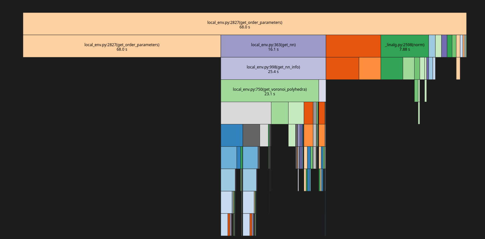

# Installation

Use venv

pip install -r requirements.txt

## What is it
Local Structural Order Parameter (LSOP) analysis. 
Instead of just counting how many neighbors an atom has, the program calculates the geometric quality of the neighborhood. The code takes the positions of all atoms in a Armstrong difined radius box and calculates:
1. Bond Angles: The precise angle between every neighbor-center-neighbor trio.
2. Symmetry Matching: How closely those angles match ideal mathematical shapes (like a perfect tetrahedron or octahedron).
3. Numerical Scores: A vector of values (0.0 to 1.0) representing the "shape profile" of every single atom.
## Why calculate it  
1. Mapping Disorder and Defects
2. Identifying Phase Transitions(melting point)

# Implementation
To achive the desired outcome we must implement the following steps:
* Data Aquisition from the Material Project API. 
* Scaling up the cell. The default unit cell is to small for any meaningfull statistical analysis.  
* Neighborhood watch. Using a Voronoi tessellation to intelligently decide which atoms are actually "bonded" or coordinated.
* Geometric Fingerprinting. This recognizes the shape of the cell.
* The Bond Valence Analysis.  

The [initial Python-based workflow](naive_main.py "Implementation") proved computationally prohibitive for large-scale simulations. Profiling [data](Results/kprofile.txt "Data") indicates that the primary overhead resides in the calculation of local structural order parameters (80% of total runtime). Specifically, the algorithm suffers from $O(N^3)$ scaling relative to the supercell dimensions and $O(N^2)$ scaling for neighbor-tree queries, leading to inefficient processing as the local environment density increases  

Thus the following claims can be made here:
* **Claim A**: Data Parallelism. The profile shows that 98% of execution time (Lines 84 & 87) is spent inside a loop where each iteration is independent. This structure allows for near-linear scaling using MPI or Multiprocessing, as the structure can be decomposed and sites distributed across different cluster nodes with zero inter-node communication required during the calculation phase.
* **Claim B**: Algorithmic Bottleneck. Micro-profiling reveals that get_order_parameters is the primary computational bottleneck (86.1% of runtime). This function performs heavy trigonometric and spherical harmonic calculations in Python. A C++ implementation using a library like Eigen or GSL for the math, exposed via pybind11, would significantly reduce the 'Per Hit' time by eliminating Python's object overhead and utilizing SIMD vectorization.
According to Amdahl's Law, the maximum speedup we can get is limited by the part of the code that cannot be parallelized, given by: $$Speedup = \frac{1}{s + \frac{1-s}{p}}$$  
Since the serial fraction is just 0.02%, running this on multiple cores the theoretical speedup is massive.
