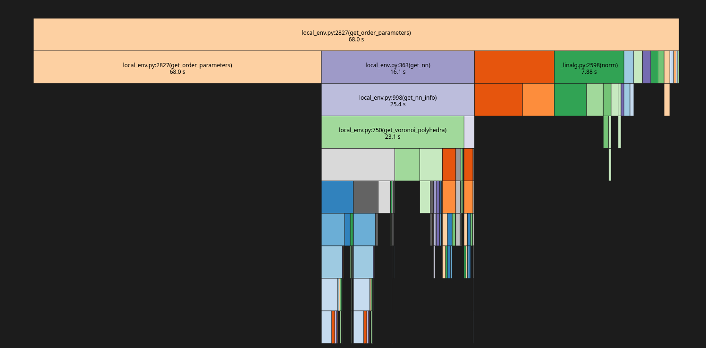
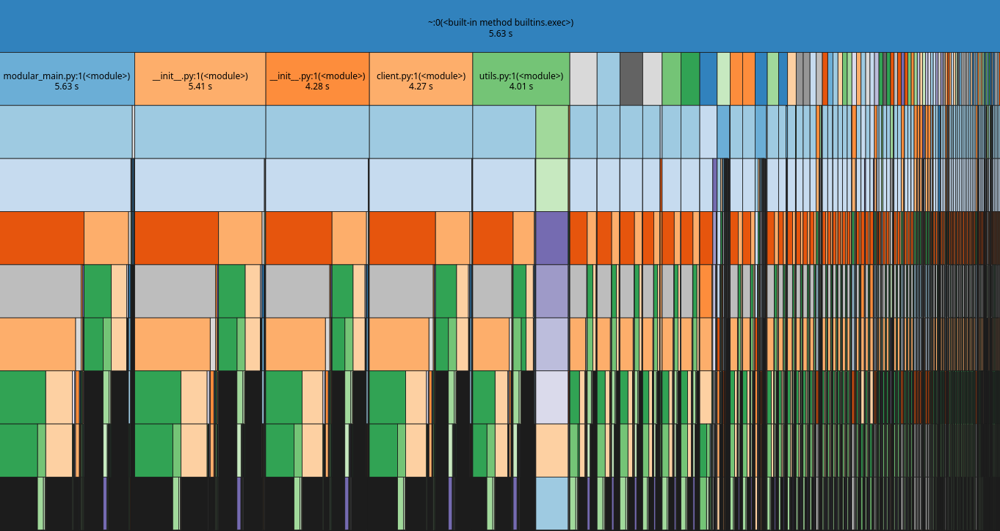
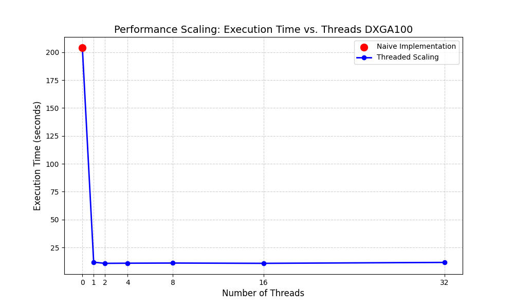
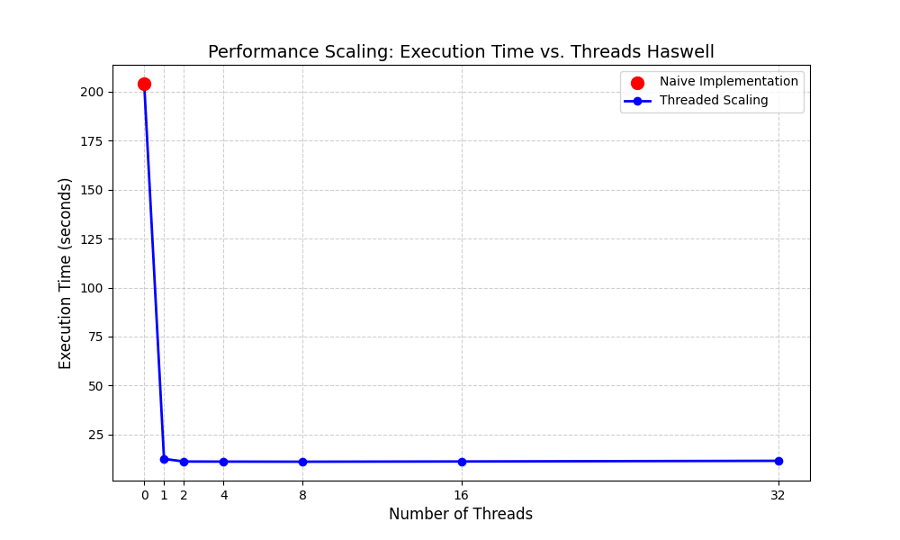
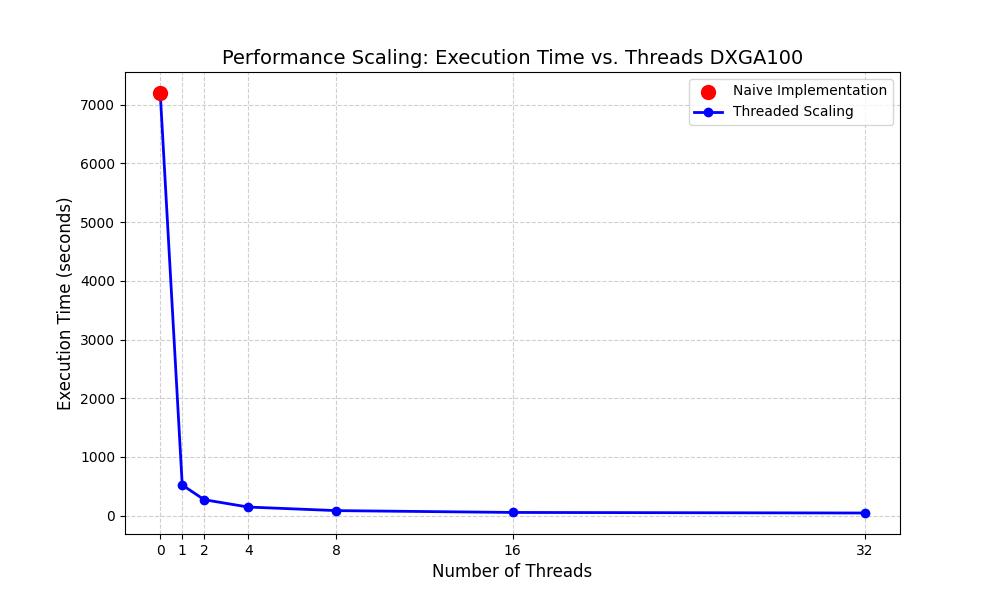
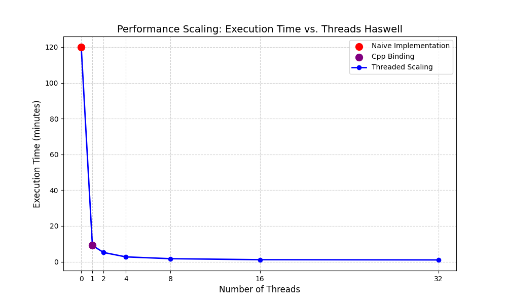
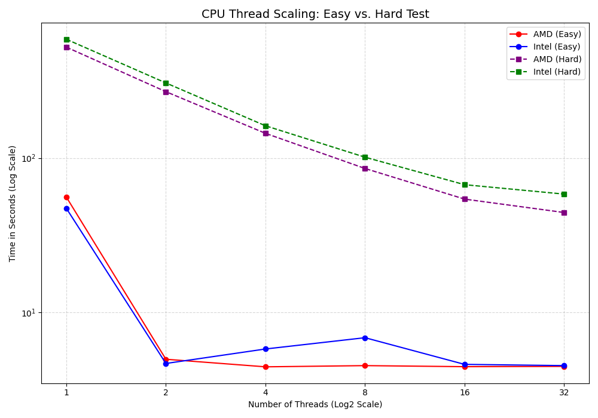
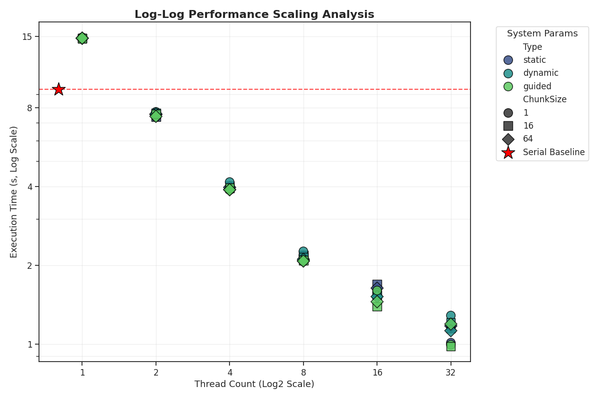

# Project: Local Structural Order Parameter (LSOP) analysis. 

## Team 
* Hazaparu Sorin-Daniel (2025-2026 AAC)
* Grosu Gabriela-Cătălina (2025-2026 AAC)

## Description
Instead of just counting how many neighbors an atom has, the program calculates the geometric quality of the neighborhood. The code takes the positions of all atoms in a Armstrong difined radius box and calculates:
1. Bond Angles: The precise angle between every neighbor-center-neighbor trio.
2. Symmetry Matching: How closely those angles match ideal mathematical shapes (like a perfect tetrahedron or octahedron).
3. Numerical Scores: A vector of values (0.0 to 1.0) representing the "shape profile" of every single atom.
## Why calculate it  
1. Mapping Disorder and Defects
2. Identifying Phase Transitions(melting point)


## Scenarios
We choose 3 scenarios based on the computation difficulty and resoruces needed:
 * Easy: Silicon, with 25 neighbors and a cutoff value of 4 
 * Hard: Lithium Oxide, with 50 neighbors and a cutoff value of 10
 * Cluster: Hexagonal Lithium Oxide, with 100 neighbors and a cutoff value of 25

# Implementation
To achive the desired outcome we must implement the following steps:
* Data Aquisition from the Material Project API. 
* Scaling up the cell. The default unit cell is to small for any meaningfull statistical analysis.  
* Neighborhood watch. Using a Voronoi tessellation to intelligently decide which atoms are actually "bonded" or coordinated.
* Geometric Fingerprinting. This recognizes the shape of the cell.
* The Bond Valence Analysis.  

The [initial Python-based workflow](naive_main.py "Implementation") proved computationally prohibitive for large-scale simulations. Profiling [data](Results/kprofile.txt "Data") indicates that the primary overhead resides in the calculation of local structural order parameters (80% of total runtime). Specifically, the algorithm suffers from $O(N^3)$ scaling relative to the supercell dimensions and $O(N^2)$ scaling for neighbor-tree queries, leading to inefficient processing as the local environment density increases  

Thus the following claims can be made here:
* **Claim A**: Data Parallelism. The profile shows that 98% of execution time (Lines 84 & 87) is spent inside a loop where each iteration is independent. This structure allows for near-linear scaling using MPI or Multiprocessing, as the structure can be decomposed and sites distributed across different cluster nodes with zero inter-node communication required during the calculation phase. According to Amdahl's Law, the maximum speedup we can get is limited by the part of the code that cannot be parallelized, given by: $$Speedup = \frac{1}{s + \frac{1-s}{p}}$$  
Since the serial fraction is just 0.02%, running this on multiple cores the theoretical speedup is massive.
* **Claim B**: Algorithmic Bottleneck. Micro-profiling reveals that get_order_parameters is the primary computational bottleneck (86.1% of runtime). This function performs heavy trigonometric and spherical harmonic calculations in Python. A C++ implementation using a library like Eigen or GSL for the math, exposed via pybind11, would significantly reduce the 'Per Hit' time by eliminating Python's object overhead and utilizing SIMD vectorization.


While the initial [parallel implementation](paralel_main.py "Implementation") in Python (utilizing a worker-pool architecture) yielded significant performance gains—reducing execution time for baseline test cases from minutes to seconds—the scalability limits were reached during high-complexity "Hard" test scenarios. Since the atomic order parameters are independent of one another, the workload is embarrassingly parallel, allowing for a lock-free execution model. However, the inherent overhead of the Python interpreter remained the primary bottleneck.

To address this, the architecture was transitioned to a hybrid C++/Python framework. Rather than refactoring the entire library, a targeted optimization strategy was employed by re-implementing the computationally expensive [get_order_parameters](CppBindings/src/HarmonicModule.cpp "Implementation") function as a C++ extension.

### Key Implementation Details:
* Linear Assignment Optimization: The implementation utilizes the [Hungarian Algorithm](https://github.com/mcximing/hungarian-algorithm-cpp.git "Lib Site") to solve the assignment problem efficiently, reducing the complexity of atomic mapping.

* Linear Algebra Integration: The [Eigen library](https://github.com/PX4/eigen.git "Lib Site") was integrated to handle high-performance matrix operations and coordinate transformations with SIMD optimizations.

* Domain-Specific Constraints: To ensure development efficiency, the implementation was scoped specifically to the geometric shapes relevant to this study, rather than a generalized library for all possible configurations.

This architectural shift leverages the interoperability of C++ for low-level memory management and heavy numerical computation while maintaining the flexibility of Python for high-level data orchestration.

This resulted in a transformative increase in computational throughput. By offloading the function logic to a compiled environment, we achieved near-linear scaling across CPU cores, effectively bypassing the constraints of the GIL.

The specialized implementation reduced the time complexity overhead
associated with high-dimensional atomic configurations.
For the "Hard" test the C++ binding achieved a speedup of several orders of magnitude. This optimization shifts the primary bottleneck from CPU-bound processing to I/O operations, enabling the processing of large-scale molecular trajectories that were previously considered computationally prohibitive.




# Findings

| Implementation Strategy | Easy Scenario (Avg.) | Hard Scenario (Avg.) |
| :--- | :---: | :---: |
| **Naive Sequential (Python)** | 3.40 min | > 2.0 hours |
| **Parallel Execution (Python)** | 12.0 sec | > 15.0 min |
| **C++ Binding (Hybrid)** | 5.0 sec | 6.0 min* |
| **Parallel Hybrid (Optimized)** | **< 1.0 sec** | **40.0 sec** |

Note on Bottlenecks: In the Hybrid implementations, the core C++ computation of order parameters required only 0.01s and 0.03s respectively. The remaining execution time is attributed to Python-side data pre-processing and I/O overhead.
# Raports

## Week 1

Sorin:  
* Started by researching the a simple, computationally intensive problem. LSOP is picked and started working on the [naive approach](naive_main.py "Implementation").  
* Materials API is pretty well documented which resulted in a very fast work-flow.
* Started Profiling and analysis of the results.
* Started the [Parallelism implementation](paralel_main.py "Implementation").
* The parallel approach kills all profilers used. 
* Treid using *viztracer*. Eats more than 32 GB ram and kills the machine. Swiched to a max depth of 5. 
* The log is a json of around 1GB. Vs-code cant open it. Swiching to a max depth of 4. Noted a huge reduction in time. From minutes to secconds.
* Sucess! The hard test finishes in 1-2 secconds. The paraleism must be added to pre-processing now.
* Done! The Hard test takes 2 minutes to complete

Gabriela:
* Looking over the Materials site and capabilities.
* Getting an API Key.
* Directing env vars.
* Python libs dont work, swiching to minimal dependencies ones.
* Organised repo and requirements.
* After the hard scenario fails with paraleism, started looking into C++ openmp speed up options.
* Pybind11 is a perfect fit. Reimplementing the whole LSOP is too difficult. Going for a minimialist version in C++.
* Added ompen mp to c++ bindings.

## Week 2

To evaluate the scalability and architectural portability of the algorithm, the deployment was benchmarked across two heterogeneous HPC environments on the UPB cluster. We compared the legacy Intel Haswell-EP architecture (E5-2680 v3), characterized by its monolithic design, against the modern AMD Rome microarchitecture (EPYC 7742) on the DXGA100 node, which utilizes a high-bandwidth chiplet design. This selection allows for an analysis of how memory-intensive Voronoi tessellation scales across differing cache hierarchies and memory subsystems.

## Test 1

Running the [benchmaker](benchmarkCluster.sh) on the Haswell cluster  we get the results:


| Threads | DXGA100 (s) | Haswell (s) |
| :--- | :--- | :--- |
| 1 | 11.739215913 |12.615934336 |
| 2 | 10.824213070 | 11.250727104 |
| 4 | 10.859506209 | 11.213056265 |
| 8 | 10.826040867 | 11.163926227 |
| 16 | 10.951088817 | 11.278679323 |
| 32 | 11.222310490 | 11.610916813 |



## Conclusions Test 1

### Scalability Plateaus and Synchronization Overhead  
Both architectures encounter a performance plateau. On the AMD node, a regressive trend is observed at $n=4$
($10.859s$), likely attributable to NUMA effects or bus contention. The Intel architecture demonstrates superior stability, maintaining a consistent wall time of $\approx 11s$.
The AMD architecture achieves the lowest absolute wall time at $n=4$ ($10.82.51s$).

## Test 2:

| Threads | DXGA100 (m) | Haswell (m) |
| :--- | :--- | :--- |
| 1 | 8.68800 | 9.0953635 |
| 2 | 4.52099 | 5.1503131 |
| 4 | 2.44168 | 2.69269 |
| 8 | 1.43046 | 1.68211 |
| 16 | 0.91202 | 1.11832 |
| 32 | 0.75237 | 0.99239 |



## Conclusions Test 2

### 1. Architectural IPC Advantage and Baseline Latency
The AMD architecture demonstrates up to 1.30% performance lead over the Intel architecture in multi threaded execution. This delta is representative of the generational leap in IPC and branch prediction efficiency between the Haswell and Rome microarchitectures.
### 2. Parallel Efficiency and Scaling Deceleration
Both architectures exhibit a classic sub-linear scaling curve. While the transition from 1 to 4 threads shows strong efficiency ($S \approx 2.1x$), a significant scaling "knee" appears beyond $n=8$ threads.
* Intel Node: This degradation is characteristic of Resource Contention, specifically within the Execution Units shared by logical threads on the 24-core Intel node.
* AMD Node: Maintains a slightly higher efficiency at $n=32$ ($S = 1.48639x$). The superior performance is attributed to the larger L3 cache hierarchy (256MB on AMD vs 60MB on Intel), which mitigates the memory-access bottlenecks associated with high-concurrency geometric computations.


## Both tests conclusions
### 1. Cache-Resident Transitions  
When we move to $n \ge 2$, the workload is partitioned such that the active data fits entirely within the aggregate L3 cache of the allocated cores. Once the problem becomes "cache-resident," additional threads provide zero marginal gain, which is why the time flatlines at $\approx 11s$ for both architectures.
### 2. The "Hard" Test: Pure Compute Scaling
In the Hard test, the workload is large enough that it cannot be "hidden" in the cache, forcing a reliance on raw clock speed and memory bandwidth. The AMD EPYC architecture consistently outperforms the Intel Haswell by 11-24%. This is the result of the 5-year generational gap in IPC  and the faster DDR4-3200 memory bus on the AMD nodes.



## Week 3

The third week of analysis focused on C++ Binding performance utilizing a custom compound with $6 \times 10^6$ parameters. The evaluation explored the scaling behavior across varying thread counts (1 to 32), chunk sizes (1, 16, 32), and OpenMP scheduling strategies (Dynamic, Static, and Guided). 

| Type | ChunkSize | Threads | Time |  
| :--- | :--- | :--- | :---|  
| 0 | 0 | 0 | 9.38855 |  
| static | 1 | 1 | 14.8407 |
| static | 1 | 2 | 7.55614 |
| static | 1 | 4 | 3.96014 |
| static | 1 | 8 | 2.18202 |
| static | 1 | 16 | 1.60231 |
| static | 1 | 32 | 1.01206 |
| static | 16 | 1 | 14.7254 |
| static | 16 | 2 | 7.3913 |
| static | 16 | 4 | 4.0239 |
| static | 16 | 8 | 2.18116 |
| static | 16 | 16 | 1.69198 |
| static | 16 | 32 | 1.14925 |
| static | 64 | 1 | 14.7523 |
| static | 64 | 2 | 7.53523 |
| static | 64 | 4 | 3.97007 |
| static | 64 | 8 | 2.08072 |
| static | 64 | 16 | 1.63659 |
| static | 64 | 32 | 1.17323 |
| dynamic | 1 | 1 | 14.8345 |
| dynamic | 1 | 2 | 7.71467 |
| dynamic | 1 | 4 | 4.16052 |
| dynamic | 1 | 8 | 2.26142 |
| dynamic | 1 | 16 | 1.57013 |
| dynamic | 1 | 32 | 1.28565 |
| dynamic | 16 | 1 | 14.7597 |
| dynamic | 16 | 2 | 7.63448 |
| dynamic | 16 | 4 | 3.94774 |
| dynamic | 16 | 8 | 2.14317 |
| dynamic | 16 | 16 |1.53853  |
| dynamic | 16 | 32 |1.20758  |
| dynamic | 64 | 1 | 14.7312 |
| dynamic | 64 | 2 | 7.57152 |
| dynamic | 64 | 4 | 3.891 |
| dynamic | 64 | 8 | 2.10814 |
| dynamic | 64 | 16 |1.51857  |
| dynamic | 64 | 32 |1.12501  |
| guided | 1 | 1 | 14.7222 |
| guided | 1 | 2 | 7.38062 |
| guided | 1 | 4 | 3.87572 |
| guided | 1 | 8 | 2.06846 |
| guided | 1 | 16 | 1.60227 |
| guided | 1 | 32 | 0.994523 |
| guided | 16 | 1 | 14.7332 |
| guided | 16 | 2 | 7.56928 |
| guided | 16 | 4 | 3.94669 |
| guided | 16 | 8 | 2.08977 |
| guided | 16 | 16 | 1.39085 |
| guided | 16 | 32 | 0.980087 |
| guided | 64 | 1 | 14.7512 |
| guided | 64 | 2 | 7.41044 |
| guided | 64 | 4 | 3.88733 |
| guided | 64 | 8 | 2.07546 |
| guided | 64 | 16 | 1.45129 |
| guided | 64 | 32 | 1.19283 |




Preliminary results indicate a strong positive correlation between thread density and execution throughput. While thread count was the primary driver of performance, scheduling type and chunk size demonstrated a secondary, albeit measurable, impact.
At the maximum concurrency of 32 threads, the optimal configuration was achieved using Guided scheduling with a Chunk size of 16, yielding an execution time of 0.980ms. In contrast, the least efficient 32-thread configuration (Dynamic, Chunk 1) resulted in a latency of 1.285ms, representing a 23.7% performance delta within the high-concurrency tier.
# Installation

Our Recomandation is using venv:
```
python3 -m venv venv # or virtualvenv venv (Arch linux)

source venv/bin/activate

pip install -r requirements.txt

cmake --preset release
cmake --build --preset release -j
```
This creates the actual bindings for your target machine. Then you may run modular_main.py.